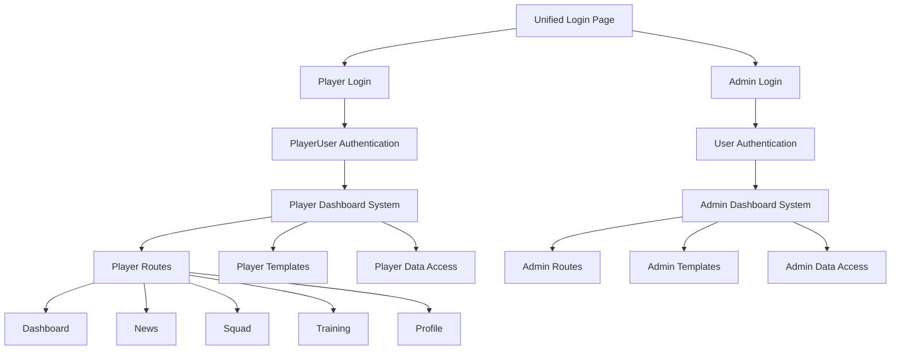
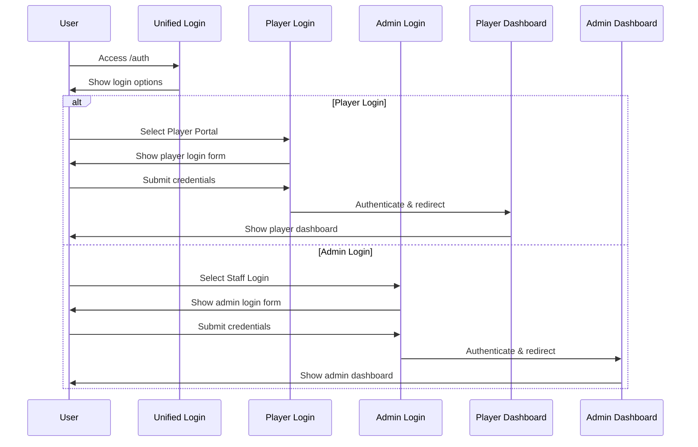
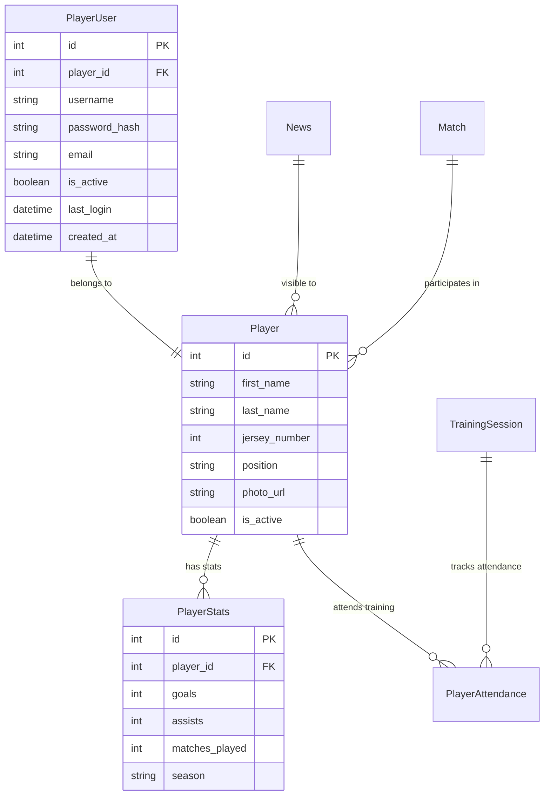

# Player Dashboard Separation - Design Document

## Overview

The player dashboard separation feature provides a completely isolated user experience for players, distinct from the administrative interface. This design implements role-based access control with separate authentication systems, dedicated user interfaces, and secure data isolation between player and admin functionalities.

## Architecture

### High-Level Architecture

### Authentication Flow

## Components and Interfaces

### 1. Authentication System

#### PlayerUser Model
- **Purpose**: Separate user model for players with different authentication flow
- **Key Fields**:
  - `player_id`: Foreign key to Player model
  - `username`: Unique login identifier
  - `password_hash`: Encrypted password
  - `email`: Contact email
  - `is_active`: Account status
  - `last_login`: Login tracking
  - `created_at`: Account creation timestamp

#### Authentication Decorators
- **`@player_required`**: Protects player-only routes
- **`@admin_required`**: Protects admin-only routes
- **Role detection**: Automatic user type identification in `load_user()`

### 2. User Interface Components

#### Player Base Template (`templates/player/base.html`)
- **Navigation**: Sidebar navigation with player-specific menu items
- **Branding**: Dynamic team branding using TeamSettings
- **Layout**: Mobile-responsive design with Bootstrap 5
- **Theme**: Distinct visual identity from admin interface

#### Player Dashboard (`templates/player/dashboard.html`)
- **Personal Stats**: Goals, matches played, upcoming events
- **Quick Access Cards**: Training, matches, news overview
- **Personalized Content**: Player-specific information display
- **Interactive Elements**: Links to detailed views

### 3. Route Structure

#### Player Routes (`/player/*`)
- `/player/dashboard` - Main dashboard
- `/player/news` - Team news and announcements
- `/player/squad` - Team roster information
- `/player/training` - Training schedule and attendance
- `/player/profile` - Personal profile management
- `/player/logout` - Secure logout

#### Access Control
- All player routes protected by `@player_required`
- Automatic redirection for unauthorized access
- Session isolation between player and admin users

### 4. Data Access Layer

#### Player Data Services
- **News Service**: Filtered published news for players
- **Training Service**: Player-specific training sessions
- **Squad Service**: Public team roster information
- **Stats Service**: Personal player statistics
- **Profile Service**: Player profile management

#### Security Boundaries
- Players cannot access financial data
- Players cannot view other players' sensitive information
- Players cannot access administrative functions
- Read-only access to most team information

## Data Models

### Core Models Integration

### Data Relationships
- **PlayerUser** → **Player**: One-to-one relationship
- **Player** → **PlayerStats**: One-to-many (by season)
- **Player** → **PlayerAttendance**: One-to-many (training sessions)
- **News**: Many-to-many visibility (published news visible to all players)

## Error Handling

### Authentication Errors
- **Invalid Credentials**: Clear error messages without revealing user existence
- **Account Disabled**: Specific message for deactivated accounts
- **Session Expiry**: Automatic redirect to login with context preservation

### Authorization Errors
- **Access Denied**: Redirect to appropriate login page
- **Route Protection**: Automatic handling of unauthorized access attempts
- **Data Filtering**: Silent filtering of unauthorized data

### User Experience Errors
- **Network Issues**: Graceful degradation with offline indicators
- **Data Loading**: Loading states and error recovery
- **Form Validation**: Client-side and server-side validation

## Testing Strategy

### Unit Testing
- **Authentication Logic**: PlayerUser model methods
- **Route Protection**: Decorator functionality
- **Data Access**: Service layer methods
- **Template Rendering**: Context data validation

### Integration Testing
- **Login Flow**: End-to-end authentication process
- **Navigation**: Route transitions and access control
- **Data Display**: Correct information filtering
- **Session Management**: Login/logout functionality

### Security Testing
- **Access Control**: Unauthorized route access attempts
- **Data Isolation**: Cross-user data access prevention
- **Session Security**: Session hijacking prevention
- **Input Validation**: SQL injection and XSS prevention

### User Acceptance Testing
- **Player Experience**: Dashboard usability and information relevance
- **Mobile Responsiveness**: Cross-device functionality
- **Performance**: Page load times and responsiveness
- **Accessibility**: Screen reader compatibility and keyboard navigation

## Security Considerations

### Authentication Security
- **Password Hashing**: Werkzeug secure password hashing
- **Session Management**: Flask-Login secure session handling
- **CSRF Protection**: Form token validation
- **Rate Limiting**: Login attempt throttling (recommended)

### Authorization Security
- **Role-Based Access**: Strict route protection
- **Data Filtering**: Server-side data access control
- **Session Isolation**: Separate session contexts
- **Audit Logging**: Access attempt logging (recommended)

### Data Security
- **Sensitive Data Protection**: Financial and administrative data isolation
- **Personal Information**: Appropriate player data access
- **Data Validation**: Input sanitization and validation
- **Secure Communication**: HTTPS enforcement (production)

## Performance Considerations

### Database Optimization
- **Query Efficiency**: Optimized database queries with proper joins
- **Caching Strategy**: Session-based caching for frequently accessed data
- **Index Usage**: Proper database indexing for user lookups
- **Connection Pooling**: Efficient database connection management

### Frontend Performance
- **Asset Optimization**: Minified CSS/JS and image optimization
- **Lazy Loading**: Progressive content loading for large datasets
- **Responsive Design**: Mobile-first approach for performance
- **CDN Usage**: External library delivery via CDN

### Scalability
- **Session Storage**: Scalable session management
- **Load Balancing**: Stateless design for horizontal scaling
- **Database Scaling**: Read replica support for player data
- **Caching Layer**: Redis/Memcached integration capability

## Deployment Considerations

### Environment Configuration
- **Database Settings**: Separate player and admin database access patterns
- **Security Keys**: Proper secret key management
- **Email Configuration**: Player notification system setup
- **File Storage**: Player photo and document storage

### Monitoring and Logging
- **Access Logging**: Player login and activity tracking
- **Error Monitoring**: Application error tracking and alerting
- **Performance Monitoring**: Response time and resource usage tracking
- **Security Monitoring**: Unauthorized access attempt detection

### Backup and Recovery
- **Data Backup**: Player account and profile data backup
- **Session Recovery**: Graceful session restoration
- **Disaster Recovery**: System restoration procedures
- **Data Migration**: Player data migration capabilities