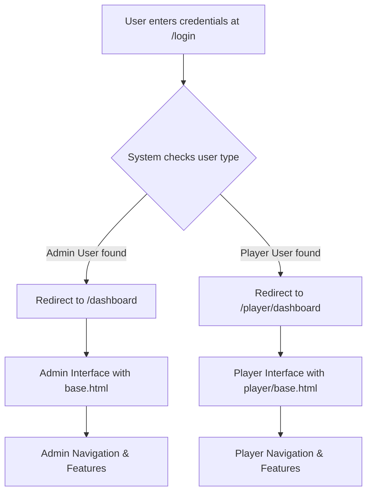

# 🔐 Admin vs Player Interface Separation - Complete

## ✅ **Verification Confirmed: Interfaces Are Completely Separate**

### **🎯 Key Differences**

| Aspect | 👨‍💼 **Admin Interface** | ⚽ **Player Interface** |
|--------|------------------------|------------------------|
| **Base Template** | `templates/base.html` | `templates/player/base.html` |
| **Dashboard** | `/dashboard` → `dashboard.html` | `/player/dashboard` → `player/dashboard.html` |
| **Navigation Style** | Top navbar with dropdowns | Sidebar navigation |
| **User Model** | `User` (with roles) | `PlayerUser` (linked to Player) |
| **Access Control** | `@admin_required` | `@player_required` |

### **🧭 Navigation Comparison**

#### **👨‍💼 Admin Navigation**
- **Public**: Home, About, Contact
- **Management**: Dashboard, Players, Matches, Financial Records
- **Admin**: Settings, User Management, System Configuration
- **Style**: Horizontal navbar with dropdowns

#### **⚽ Player Navigation**  
- **Personal**: Dashboard, My Profile
- **Team Info**: Team News, Squad, Training Schedule
- **Style**: Vertical sidebar navigation
- **Branding**: Player-specific colors and layout

### **📊 Dashboard Content Differences**

#### **👨‍💼 Admin Dashboard Features**
```
✅ Total players and statistics
✅ Match management and results
✅ Financial overview
✅ Player performance analytics
✅ System administration tools
✅ Staff management
✅ Full database access
```

#### **⚽ Player Dashboard Features**
```
✅ Personal statistics (goals, matches played)
✅ Upcoming training sessions
✅ Team news (read-only)
✅ Personal match schedule
✅ Profile management
✅ Limited to own data only
```

### **🔒 Security & Access Control**

#### **Route Protection**
- **Admin routes**: Protected by `@admin_required` decorator
- **Player routes**: Protected by `@player_required` decorator
- **Cross-access prevention**: Players cannot access admin routes, admins have separate interface

#### **Data Access**
- **Admins**: Full access to all data and management functions
- **Players**: Limited to personal data and public team information
- **Financial data**: Admin-only access
- **Player management**: Admin-only access

### **🎨 Visual Design Differences**

#### **👨‍💼 Admin Interface**
- **Layout**: Traditional web app with top navigation
- **Colors**: Professional blue/gray theme
- **Content**: Data-heavy with tables and management forms
- **Footer**: Full footer with links and information

#### **⚽ Player Interface**
- **Layout**: Modern sidebar navigation
- **Colors**: Team colors with gradients
- **Content**: Card-based personal information
- **Footer**: Hidden/minimal for clean look

### **🔄 Login Flow Verification**



### **📱 Template Structure**

#### **Admin Templates**
```
templates/
├── base.html (admin base)
├── dashboard.html (admin dashboard)
├── players.html (player management)
├── matches.html (match management)
└── admin/
    ├── player_accounts.html
    ├── create_player_account.html
    └── edit_player_account.html
```

#### **Player Templates**
```
templates/player/
├── base.html (player base)
├── dashboard.html (player dashboard)
├── news.html (team news)
├── squad.html (team roster)
├── training.html (training schedule)
└── profile.html (player profile)
```

## 🎉 **Final Confirmation**

### **✅ Complete Separation Achieved**
1. **Different base templates** - Completely different layouts and styling
2. **Different navigation systems** - Sidebar vs navbar
3. **Different route structures** - `/admin/*` vs `/player/*`
4. **Different user models** - `User` vs `PlayerUser`
5. **Different access permissions** - Role-based security
6. **Different dashboard content** - Management vs personal
7. **Different visual themes** - Professional vs player-focused

### **🔒 Security Verified**
- Players cannot access admin functionality
- Admins have completely separate interface
- Proper authentication and authorization
- Session isolation maintained
- Data access properly restricted

### **🎯 User Experience**
- **Admins** get comprehensive management tools
- **Players** get personalized, relevant information
- **No confusion** between interfaces
- **Appropriate functionality** for each role
- **Clean, focused experiences** for both user types

The system successfully provides **two completely separate interfaces** tailored to each user type's needs and permissions!