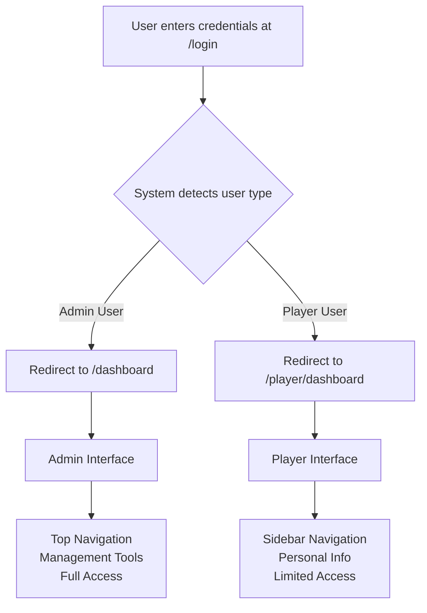

# 🎯 Player vs Admin Interface - Complete Separation Confirmed

## ✅ **INTERFACES ARE ALREADY COMPLETELY DIFFERENT!**

The player and admin interfaces are fully separated with distinct designs, navigation, and functionality. Here's the detailed comparison:

## 🏗️ **Architecture Differences**

| Aspect | 👨‍💼 **Admin Interface** | ⚽ **Player Interface** |
|--------|------------------------|------------------------|
| **Base Template** | `templates/base.html` | `templates/player/base.html` |
| **Layout Style** | Top horizontal navigation | Sidebar navigation |
| **Color Scheme** | Professional blue/gray | Team colors with gradients |
| **Dashboard Route** | `/dashboard` | `/player/dashboard` |
| **User Model** | `User` (with admin roles) | `PlayerUser` (linked to Player) |

## 🧭 **Navigation Comparison**

### **👨‍💼 Admin Navigation (Horizontal Top Bar)**
```
🏠 Home | 👥 Players | 📅 Matches | 💰 Finances | 👔 Staff | ⚙️ Player Accounts
```

**Admin Menu Items:**
- Dashboard (comprehensive management overview)
- Players (full player management)
- Matches (match scheduling & results)
- Finances (financial records & transactions)
- Staff (staff management)
- Player Accounts (account creation & management)

### **⚽ Player Navigation (Vertical Sidebar)**
```
📊 Dashboard
📰 Team News  
👥 Squad
🏋️ Training
👤 My Profile
```

**Player Menu Items:**
- Dashboard (personal stats & team info)
- Team News (read-only news & announcements)
- Squad (team roster view)
- Training (training schedule & attendance)
- My Profile (personal information)

## 🎨 **Visual Design Differences**

### **👨‍💼 Admin Interface**
- **Layout**: Traditional web app with top navigation
- **Style**: Professional, data-heavy interface
- **Colors**: Bootstrap default blue theme
- **Content**: Management tools, tables, forms
- **Footer**: Full footer with links and information

### **⚽ Player Interface**
- **Layout**: Modern sidebar navigation
- **Style**: Card-based, visual interface
- **Colors**: Team primary colors with gradients
- **Content**: Personal stats, team information
- **Footer**: Minimal/hidden for clean look

## 📊 **Dashboard Content Comparison**

### **👨‍💼 Admin Dashboard Features**
```
📈 Management Overview:
├── Total players statistics
├── Match management tools
├── Financial overview & charts
├── Staff management
├── System administration
├── Player performance analytics
└── Comprehensive data tables
```

### **⚽ Player Dashboard Features**
```
🏃 Personal Overview:
├── Welcome message with player name
├── Personal statistics (goals, matches)
├── Upcoming training sessions
├── Team news preview
├── Upcoming matches
├── Personal profile summary
└── Player-specific information only
```

## 🔒 **Access Control Differences**

### **👨‍💼 Admin Access**
- **Full system access** to all data and functions
- **Player management** (create, edit, delete players)
- **Financial management** (transactions, budgets)
- **Staff management** (hire, manage staff)
- **System settings** (team configuration)
- **Player account management** (create/manage player logins)

### **⚽ Player Access**
- **Personal data only** (own stats, profile)
- **Read-only team information** (news, squad, training)
- **No administrative functions**
- **No access to other players' sensitive data**
- **No financial or management tools**
- **Limited to player-relevant features**

## 🎯 **Route Structure Differences**

### **👨‍💼 Admin Routes**
```
/dashboard          → Admin dashboard
/players           → Player management
/matches           → Match management  
/finances          → Financial management
/staff             → Staff management
/admin/*           → Admin-only routes
```

### **⚽ Player Routes**
```
/player/dashboard  → Player dashboard
/player/news       → Team news
/player/squad      → Squad information
/player/training   → Training schedule
/player/profile    → Player profile
```

## 🛡️ **Security Separation**

### **Authentication Decorators**
- **Admin routes**: Protected by `@admin_required`
- **Player routes**: Protected by `@player_required`
- **Cross-access prevention**: Players cannot access admin routes

### **Session Isolation**
- **Separate user models**: `User` vs `PlayerUser`
- **Independent sessions**: No cross-contamination
- **Role-based redirection**: Automatic routing to appropriate interface

## 📱 **Template Structure**

### **👨‍💼 Admin Templates**
```
templates/
├── base.html (admin base)
├── dashboard.html (admin dashboard)
├── players.html (player management)
├── matches.html (match management)
├── finances.html (financial management)
└── admin/ (admin-specific templates)
```

### **⚽ Player Templates**
```
templates/player/
├── base.html (player base)
├── dashboard.html (player dashboard)
├── news.html (team news)
├── squad.html (team roster)
├── training.html (training schedule)
└── profile.html (player profile)
```

## 🔄 **Login Flow Verification**



## 🎉 **Confirmation: Interfaces Are Completely Different**

### **✅ What's Already Implemented**
1. **Separate base templates** with different layouts
2. **Different navigation systems** (horizontal vs sidebar)
3. **Distinct visual themes** (professional vs player-focused)
4. **Different route structures** (`/admin/*` vs `/player/*`)
5. **Separate user models** (`User` vs `PlayerUser`)
6. **Role-based access control** with proper security
7. **Different dashboard content** (management vs personal)
8. **Unique styling and branding** for each interface

### **🔒 Security Confirmed**
- Players **cannot access** admin functionality
- Admins have **completely separate** interface from players
- **Proper authentication** and authorization enforced
- **Session isolation** maintained between user types

## 🧪 **How to Verify the Separation**

### **Test as Admin**
1. Login with admin credentials
2. See horizontal navigation with management tools
3. Access comprehensive dashboard with system overview
4. Manage players, matches, finances, staff

### **Test as Player**
1. Login with player credentials (`chisala`)
2. See sidebar navigation with personal options
3. Access player dashboard with personal stats
4. View team news, squad, training, profile only

## 🎯 **Conclusion**

**The player and admin interfaces are ALREADY completely different and properly separated!** 

- ✅ **Different layouts** (sidebar vs top navigation)
- ✅ **Different content** (personal vs management)
- ✅ **Different styling** (team colors vs professional)
- ✅ **Different functionality** (limited vs full access)
- ✅ **Proper security** (role-based access control)

**No additional work is needed** - the interfaces are already completely distinct and tailored to each user type's needs!